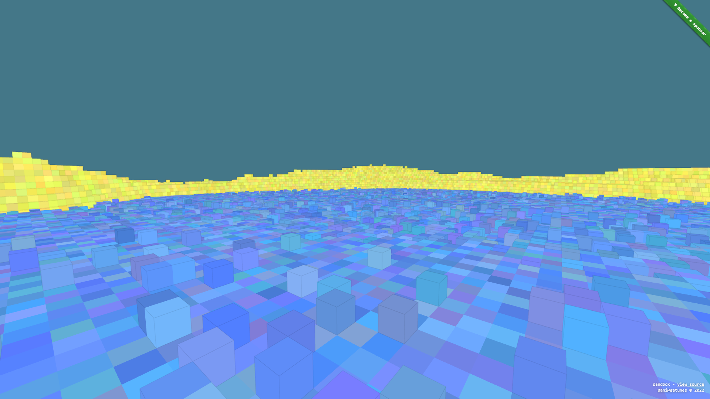

[sandbox](https://github.com/AIEdX/sandboxWebGPU)
==

[](https://aiedx.com)

### Dev environment

```bash
# clone repo:
git clone https://github.com/AIEdX/sandboxWebGPU.git
cd sandbox
# install dependencies:
npm install
# start environment:
npm start
# open http://localhost:8080/ in your browser
```
